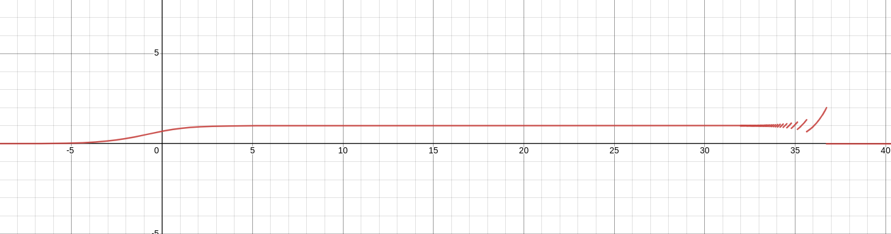
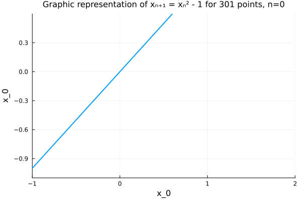
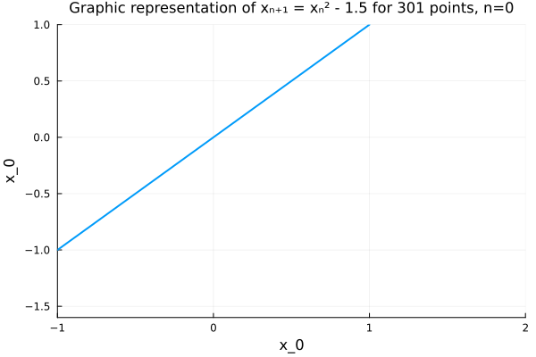
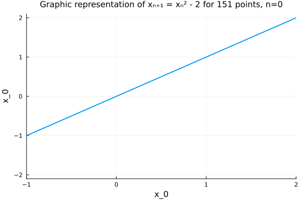
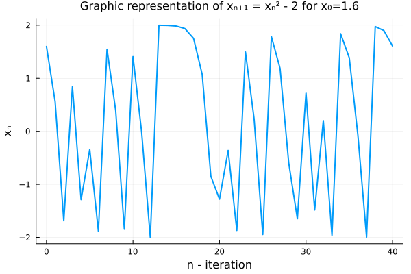

# Lista 2. Sprawozdanie | Mateusz Pełechaty 261737
## Zadanie 1

### 1.1 Powtórz zadanie 5 z listy 1, ale usuń ostatnią 9 z $x_4$ i ostatnią 7 z $x_5$
Rozwiązanie zadania znajduje się w pliku `solution.jl`
Wyniki:  
|              | Float32    | Float32 - changed | Float64                 | Float64 - changed     |
|--------------|------------|-------------------|-------------------------|-----------------------|
| Front        | -0.4999443 | -0.4999443        | 1.0251881368296672e-10  | -0.004296342739891585 |
| Back         | 0.4543457  | -0.4543457        | -1.5643308870494366e-10 | -0.004296342998713953 |
| Big to small | -0.5       | -0.5              | 0.0                     | -0.004296342842280865 |
| Small to big | -0.5       | -0.5              | 0.0                     | -0.004296342842280865 |
  

### 1.2 Jaki wpływ na wyniki mają niewielkie zmiany danych?
Niewielka zmiana danych sprawila ze wynik Float32 dla Back się zmienił na negatywny.
Natomiast dla Float64 wszystkie wyniki się zmieniły, i fakt ze wszystkie 4 wskazuja na to samo sugeruje ze wynik jest mniej wiecej poprawny. Zmiany są nieprzewidywalne

## Zadanie 2
### 2.1 Zwizualizuj funkcję $f(x) = e^xln(1+e^{-x})$ w conajmniej dwóch programach do wizualizacji
Z lewej - Wykres narysowany w programie `WolframAlpha` - Nie posiadam wolframPro by zobaczyc caly wykres <br/>
Z prawej - Wykres narysowany w programie `Recher Online`  <br/>
 
</br>
Wykres narysowany w programie `Desmos` <br/>
 <br/>

### 2.2 Policz granicę funkcji $lim_{x->\infty}f(x)$. 
Według `WolframAlpha` $lim_{x->\infty}f(x) = 1$  
Według mnie: $lim_{x->\infty}f(x) = lim_{x->\infty} e^xln(1+e^{-x}) = lim_{x->\infty} \frac{ln(1+e^{-x})}{e^{-x}} = (\star)$.  
Zauważmy, że  $lim_{x->\infty} ln(1+e^{-x}) = lim_{x->\infty} e^{-x} = 0$  
Stąd możemy skorzystać z reguły de l'Hospitala   
Policzmy pochodne  
$\frac{d}{dx}ln(1+e^{-x}) = \frac{-e^{-x}}{1+e^{-x}} = \frac{-1}{e^x + 1}$  
$\frac{d}{dx}e^{-x} = -e^{-x}$  
Wracając do wcześniejszej równości  
$(\star) = lim_{x->\infty} \frac{-1}{e^x + 1} \cdot \frac{-1}{e^{-x}} = lim_{x->\infty} \frac{1}{1 + e^{-x}} = \frac{1}{1+0} = 1$  
Zatem `granica` wynosi `1`

### 2.3 Porównaj wykres z policzoną granicą
Wykresy się nie zgadzają z policzona granicą. Problem się zdecydowanie pojawia w okolicy 35

### 2.4 Wyjaśnić zjawisko
Zauważmy, że skoro $e^x$ jest duże to $1+e^{-x}$ musi być bardzo bliskie 1. Dochodzimy wtedy do kolizji z `machine epsilon`, który dla przypomnienia wynosi mniej więcej $2.22e-16$.   
Dla przykładu rozważmy $x = 42$   
Wtedy $e^x \approx 2.71^{42} \approx (2.71^7)^6 \approx 1073 ^ 6 > 1000 ^ 6 = 10^{18}$  
Wtedy $e^{-x} < 10^{-18}$ zatem $1 < 1+e^{-x} < 1 + 10^{-18}$  
Ale $1 + 10^{-18} < 1 + \frac{eps}{2}$ stąd $Float64(1+e^{-x}) = 1$  
Przez to $ln(Float64(1+e^{-x})) = ln(1.0) = 0$   
Stąd $e^x \cdot ln(1+e^{-x}) = e^x \cdot 0 = 0$  
Użyłem liczby 42, ponieważ tam mi się łatwo dowodzi rząd wielkości $e^{-x}$ w systemie dziesiętnym. Machlojki związane z niewystarczająca ilością liczb na przedziale $[1,2)$ pojawiają się w okolicy liczby 35.  

## Zadanie 4
Zadanie opiera się na wielomianach $p(x)$ oraz $P(x)$ <br/>
Przy czym $p(x) = P(x)$, ale przez $p(x)$ rozumiemy postać iloczynową, a przez $P(x)$ postać normalną <br/>
$p(x) = \prod_{i=1}^{20}(x-i)$ <br/>
$P(x) = x^{20} - 210x^{19} + 20615x^{18} - 1256850x^{17} + 53327946x^{16} - 1672280820x^{15} + 40171771630x^{14} - 756111184500x^{13} + 11310276995381x^{12} - 135585182899530x^{11} + 1307535010540395^{10} - 1014229986551145x^9 + 63030812099294896^8 - 311333643161390640x^7 + 1206647803780373360x^6 - 3599979517947607200x^5 + 8037811822645051776x^4 - 12870931245150988800x^3 + 13803759753640704000x^2 - 8752948036761600000x + 2432902008176640000$

### 4.1 Zainstaluj pakiet polynomials
Zrobiłem to poprzez wejście do `REPL`, a nastepnie użycie klawiszu `]`.  
Wtedy wpisalem `add Polynomials`  
Następnie korzystałem z [dokumentacji](https://juliamath.github.io/Polynomials.jl/stable/)
### 4.2 Użyc funkcji roots do obliczenia 20 zer wielomianu P
Rozwiązanie: Znajduje się w pliku `roots_4.2.jl` <br/>
```bash
shozy@base:~/Desktop/repos/scientific-calculations/lista2/zad4$ julia tests_4.3_4.2.jl 
ComplexF64[0.04936236350479326 - 0.001626153012699879im, 0.04936236350479326 + 0.001626153012699879im, 0.052736831941098385 - 0.006424840335157582im, 0.052736831941098385 + 0.006424840335157582im, 0.059754621003824 - 0.01246450015096291im, 0.059754621003824 + 0.01246450015096291im, 0.07155315671219971 - 0.01829397459457222im, 0.07155315671219971 + 0.01829397459457222im, 0.08906018737624743 - 0.021674687047461894im, 0.08906018737624743 + 0.021674687047461894im, 0.11212678397700025 - 0.019337476629103914im, 0.11212678397700025 + 0.019337476629103914im, 0.13900669621663228 - 0.007704608269636684im, 0.13900669621663228 + 0.007704608269636684im, 0.16723445607153706 + 0.0im, 0.1999698838712571 + 0.0im, 0.2500007072294508 + 0.0im, 0.3333333285199689 + 0.0im, 0.4999999999878469 + 0.0im, 1.0000000000000346 + 0.0im]
```

Wnioski/Spostrzeżenia: Widzimy pierwiastki bliskich $1$, $\frac{1}{2}$, $\frac{1}{3}$ zamiast $1$, $2$, $3$ <br/>
Zauważamy też, że rozwiązanie jest w liczbach zespolonych.

### 4.3 Sprawdzić obliczone pierwiastki $z_k$ $1 \leq k \leq 20$ obliczając $|P(z_k)|$, $p(z_k)$ i $|z_k - k|$
```bash
 k,                    Z_k,               |P(Z_k)|,                 p(Z_k),              |Z_k - k|
 1,     0.9999999999996989,      37168.65610443536,       36626.4254824228, 3.0109248427834245e-13
 2,     2.0000000000283182,   6.396619737584124e23,      181303.9336725767, 2.8318236644508943e-11
 3,     2.9999999995920965,   6.885444518219054e27,      290172.2858891687, 4.0790348876384996e-10
 4,     3.9999999837375317,  4.1097554876427503e30,    -2.04153729027509e6,   1.626246826091915e-8
 5,      5.000000665769791,   5.451586537771687e32,  -2.0894625006962176e7,   6.657697912970661e-7
 6,      5.999989245824773,   2.859790199820601e34,  -1.1250484577562997e8,  1.0754175226779239e-5
 7,      7.000102002793008,   7.988647578478576e35,  -4.5729086427309465e8, 0.00010200279300764947
 8,      7.999355829607762,   1.409829162793987e37,  -1.5556459377357383e9,  0.0006441703922384079
 9,      9.002915294362053,   1.778625390894598e38,    -4.68781617564839e9,   0.002915294362052734
10,      9.990413042481725,  1.6493747788145715e39, -1.2634601896949207e10,   0.009586957518274986
11,     11.025022932909318,  1.3532663088402677e40, -3.3001284744984142e10,   0.025022932909317674
12,     11.953283253846857,   7.587642698363534e40,  -7.388525665404987e10,    0.04671674615314281
13,      13.07431403244734,   5.120407981891591e41,   -1.84762150931442e11,    0.07431403244734014
14,     13.914755591802127,  1.9273676714623424e42,  -3.551427752842085e11,    0.08524440819787316
15,     15.075493799699476,  1.0582914499168598e43,  -8.423201558964255e11,    0.07549379969947623
16,     15.946286716607972,   3.488059436705628e43, -1.5707287366258018e12,    0.05371328339202819
17,     17.025427146237412,  1.4001588376996852e44, -3.3169782238892354e12,   0.025427146237412046
18,      17.99092135271648,   4.511241671406659e44,  -6.344853141791281e12,   0.009078647283519814
19,      19.00190981829944,   1.437650356213583e45, -1.2285717366719662e13,  0.0019098182994383706
20,     19.999809291236637,   4.252593528926789e45,  -2.318309535271639e13, 0.00019070876336257925
```

### 4.4 Wyjaśnić rozbieżności

### 4.5 Przeprowadzić `eksperyment Wilkinsona`, tj. zmienić współczynnik $210$ na $-210 - 2^{-23}$ i powtórzyć 4.2 i 4.3. 

### 4.6 Wyjaśnić zjawisko

## Zadanie 5
Rozważmy równanie rekurencyjne  
$p_{n+1} := p_n + r \cdot p_n(1-p_n)$, dla $n = 0,1,...$  
$r$ - dana stała</br>
$r(1-p_n)$ - czynnik wzrostu populacji </br>
$p_0$ - Wielkość populacji stanowiąca procent maksymalnej wielkości populacji dla danego środowiska </br>

### 5.1 Dla danych $p_0 = 0.01$ i $r=3$ znaleźć $p_{40}$. następnie la danych $p_0 = 0.01$ i $r=3$ znaleźć $p_{40}$, przy czym przy $p_{10}$ należy się zatrzymać i zostawić 3 cyfry po przecinku. Arytmetyka Float32. Porównaj wyniki 
Rozwiązanie znajduje się w pliku `tests_5.1.jl`
```bash
 i             normal        interrupted       |difference|
 0               0.01               0.01                0.0
 1             0.0397             0.0397                0.0
 2         0.15407173         0.15407173                0.0
 3          0.5450726          0.5450726                0.0
 4          1.2889781          1.2889781                0.0
 5          0.1715188          0.1715188                0.0
 6          0.5978191          0.5978191                0.0
 7          1.3191134          1.3191134                0.0
 8        0.056273222        0.056273222                0.0
 9         0.21559286         0.21559286                0.0
10          0.7229306              0.723        6.937981e-5
11          1.3238364           1.323813        2.348423e-5
12        0.037716985         0.03780961        9.262562e-5
13         0.14660022         0.14694974      0.00034952164
14           0.521926          0.5230163       0.0010902882
15          1.2704837           1.271427       0.0009433031
16          0.2395482         0.23612809       0.0034201145
17          0.7860428         0.77724296        0.008799851
18          1.2905813          1.2966521        0.006070733
19         0.16552472         0.14268851        0.022836208
20          0.5799036           0.509674         0.07022959
21          1.3107498          1.2593932        0.051356554
22        0.088804245         0.27935904          0.1905548
23          0.3315584         0.88331175         0.55175334
24          0.9964407           1.192528          0.1960873
25          1.0070806          0.5037429          0.5033377
26          0.9856885          1.2537007         0.26801223
27          1.0280086         0.29950637          0.7285022
28          0.9416294          0.9289133       0.0127161145
29          1.1065198          1.1270134        0.020493627
30          0.7529209         0.69757587         0.05534506
31          1.3110139          1.3304672        0.019453287
32          0.0877831          0.0114398          0.0763433
33          0.3280148        0.045366593          0.2826482
34          0.9892781         0.17529199         0.81398606
35           1.021099           0.608986         0.41211295
36         0.95646656          1.3233521         0.36688554
37          1.0813814         0.03962612          1.0417553
38         0.81736827          0.1537938         0.66357446
39          1.2652004          0.5442176          0.7209828
40         0.25860548           1.288352          1.0297465
```
Wnioski: Stworzylismy swoj wlasny generator liczb losowych lub chaosu

### 5.4 Dla danych $p_0 = 0.01$ i $r=3$ w arytmetyce Float32 i Float64. Następnie porównaj wyniki
Rozwiązanie znajduje się w pliku `tests_5_2.jl`
```bash
 i      Float32                Float64    |Float32 - Float64|
 0         0.01                   0.01 2.2351741811588166e-10
 1       0.0397                 0.0397  1.4781951912512525e-9
 2   0.15407173    0.15407173000000002  3.3555221379266698e-9
 3    0.5450726     0.5450726260444213   1.089778434160138e-8
 4    1.2889781     1.2889780011888006   9.863419747624391e-8
 5    0.1715188    0.17151914210917552  3.3946635324966223e-7
 6    0.5978191     0.5978201201070994  1.0302175730281249e-6
 7    1.3191134     1.3191137924137974  4.1865738875657144e-7
 8  0.056273222   0.056271577646256565   1.644323347926857e-6
 9   0.21559286    0.21558683923263022   6.021942906886402e-6
10    0.7229306      0.722914301179573   1.630900032811855e-5
11    1.3238364     1.3238419441684408   5.498360030165017e-6
12  0.037716985    0.03769529725473175   2.168749410857984e-5
13   0.14660022    0.14651838271355924   8.183391356172964e-5
14     0.521926      0.521670621435246  0.0002553643778948622
15    1.2704837     1.2702617739350768 0.00022195828843396548
16    0.2395482    0.24035217277824272    0.00080396644889702
17    0.7860428     0.7881011902353041  0.0020583807489149564
18    1.2905813     1.2890943027903075   0.001487042767859048
19   0.16552472    0.17108484670194324   0.005560125556313356
20    0.5799036     0.5965293124946907      0.016625709894593
21    1.3107498     1.3185755879825978   0.007825818771782345
22  0.088804245   0.058377608259430724   0.030426636735686463
23    0.3315584    0.22328659759944824    0.10827180875354858
24    0.9964407     0.7435756763951792    0.25286503224205836
25    1.0070806      1.315588346001072     0.3085077910389138
26    0.9856885    0.07003529560277899     0.9156532119541363
27    1.0280086    0.26542635452061003     0.7625822256872147
28    0.9416294     0.8503519690601384    0.09127744072990063
29    1.1065198     1.2321124623871897     0.1255926440812205
30    0.7529209    0.37414648963928676    0.37877443597793126
31    1.3110139     1.0766291714289444    0.23438476556751553
32    0.0877831     0.8291255674004515     0.7413424691796263
33    0.3280148     1.2541546500504441     0.9261398590386338
34    0.9892781    0.29790694147232066      0.691371136606903
35     1.021099     0.9253821285571046    0.09571684280977777
36   0.95646656     1.1325322626697856    0.17606570707438762
37    1.0813814     0.6822410727153098    0.39914036744734893
38   0.81736827     1.3326056469620293     0.5152373779953545
39    1.2652004  0.0029091569028512065      1.262291219607769
40   0.25860548   0.011611238029748606    0.24699424216434318
```
Wnioski: Zdecydowanie różnica nie jest czyms co jestesmy w stanie przewidziec i od iteracji 22 zaczęła się mocno rozbiegać

## Zadanie 6
Rozważamy równanie rekurencyjne </br>
$x_{n+1} := x_n^2 + c$ dla $n=0,1,...$</br> dla pewnej stałej $c$

### 6.1 Wykonać w arytmetyce Float64, 40 iteracji powyższego równania dla podanych poniżej danych wejściowych. Obserwować zachowanie generowanych ciągów
Dane wejściowe:
| ID | c  | $x_0$            |
|----|----|------------------|
| 1  | -2 | 1                |
| 2  | -2 | 2                |
| 3  | -2 | 1.99999999999999 |
| 4  | -1 | 1                |
| 5  | -1 | -1               |
| 6  | -1 | 0.75             |
| 7  | -1 | 0.25             |
Rozwiązanie można znaleźć w pliku `tests_6.1.jl`
```bash
 n     1     2                       3     4     5                       6                       7
 0   1.0   2.0        1.99999999999999   1.0  -1.0                    0.75                    0.25
 1  -1.0   2.0        1.99999999999996   0.0   0.0                 -0.4375                 -0.9375
 2  -1.0   2.0      1.9999999999998401  -1.0  -1.0             -0.80859375             -0.12109375
 3  -1.0   2.0      1.9999999999993605   0.0   0.0     -0.3461761474609375     -0.9853363037109375
 4  -1.0   2.0       1.999999999997442  -1.0  -1.0     -0.8801620749291033   -0.029112368589267135
 5  -1.0   2.0      1.9999999999897682   0.0   0.0     -0.2253147218564956     -0.9991524699951226
 6  -1.0   2.0      1.9999999999590727  -1.0  -1.0     -0.9492332761147301  -0.0016943417026455965
 7  -1.0   2.0       1.999999999836291   0.0   0.0     -0.0989561875164966     -0.9999971292061947
 8  -1.0   2.0      1.9999999993451638  -1.0  -1.0     -0.9902076729521999   -5.741579369278327e-6
 9  -1.0   2.0      1.9999999973806553   0.0   0.0    -0.01948876442658909     -0.9999999999670343
10  -1.0   2.0       1.999999989522621  -1.0  -1.0      -0.999620188061125  -6.593148249578462e-11
11  -1.0   2.0      1.9999999580904841   0.0   0.0  -0.0007594796206411569                    -1.0
12  -1.0   2.0      1.9999998323619383  -1.0  -1.0     -0.9999994231907058                     0.0
13  -1.0   2.0      1.9999993294477814   0.0   0.0  -1.1536182557003727e-6                    -1.0
14  -1.0   2.0      1.9999973177915749  -1.0  -1.0     -0.9999999999986692                     0.0
15  -1.0   2.0      1.9999892711734937   0.0   0.0 -2.6616486792363503e-12                    -1.0
16  -1.0   2.0      1.9999570848090826  -1.0  -1.0                    -1.0                     0.0
17  -1.0   2.0       1.999828341078044   0.0   0.0                     0.0                    -1.0
18  -1.0   2.0      1.9993133937789613  -1.0  -1.0                    -1.0                     0.0
19  -1.0   2.0      1.9972540465439481   0.0   0.0                     0.0                    -1.0
20  -1.0   2.0      1.9890237264361752  -1.0  -1.0                    -1.0                     0.0
21  -1.0   2.0      1.9562153843260486   0.0   0.0                     0.0                    -1.0
22  -1.0   2.0        1.82677862987391  -1.0  -1.0                    -1.0                     0.0
23  -1.0   2.0      1.3371201625639997   0.0   0.0                     0.0                    -1.0
24  -1.0   2.0    -0.21210967086482313  -1.0  -1.0                    -1.0                     0.0
25  -1.0   2.0     -1.9550094875256163   0.0   0.0                     0.0                    -1.0
26  -1.0   2.0       1.822062096315173  -1.0  -1.0                    -1.0                     0.0
27  -1.0   2.0       1.319910282828443   0.0   0.0                     0.0                    -1.0
28  -1.0   2.0     -0.2578368452837396  -1.0  -1.0                    -1.0                     0.0
29  -1.0   2.0     -1.9335201612141288   0.0   0.0                     0.0                    -1.0
30  -1.0   2.0      1.7385002138215109  -1.0  -1.0                    -1.0                     0.0
31  -1.0   2.0      1.0223829934574389   0.0   0.0                     0.0                    -1.0
32  -1.0   2.0     -0.9547330146890065  -1.0  -1.0                    -1.0                     0.0
33  -1.0   2.0     -1.0884848706628412   0.0   0.0                     0.0                    -1.0
34  -1.0   2.0     -0.8152006863380978  -1.0  -1.0                    -1.0                     0.0
35  -1.0   2.0     -1.3354478409938944   0.0   0.0                     0.0                    -1.0
36  -1.0   2.0    -0.21657906398474625  -1.0  -1.0                    -1.0                     0.0
37  -1.0   2.0      -1.953093509043491   0.0   0.0                     0.0                    -1.0
38  -1.0   2.0      1.8145742550678174  -1.0  -1.0                    -1.0                     0.0
39  -1.0   2.0      1.2926797271549244   0.0   0.0                     0.0                    -1.0
40  -1.0   2.0     -0.3289791230026702  -1.0  -1.0                    -1.0                     0.0
.   .      .       .                    .      .                      .                        .
.   .      .       .                    .      .                      .                        .
.   .      .       .                    .      .                      .                        .
100000 -1.0 2.0     1.9428219372796982  -1.0  -1.0                    -1.0                     0.0
```
Wnioski:  
Zmniejszenie $x_0$ o $\frac{1}{10^9}$ dało nam kompletnie inny wynik niż wcześniejszy. Również jest on nieprzewidywalny.   
Możemy też zauważyć, że iteracja ma tendencje do zapętlania się w jakimś zbiorze zależnym od $c$.  Wartość $x_n$ warunkuje zapętlenie, ale nie ma wplywu na zbior koncowy. Chyba ze takie zbiory bylyby 2

### 6.2 Przeprowadzić graficzną iterację $x_{n}$ dla danego $c$
Zainstalowałem pakiet `Plots` poprzez wejście do `Repl` -> `Pkg` i wpisanie komendy `add Plots`. [Dokumentacja](https://docs.juliaplots.org/latest/tutorial/) plots</br>
Iteracje graficzne były prowadzone dla podanego wcześniej `c`  
Rozwiązanie do każdego znajduje się w pliku `tests_6.2.jl`

### Iteracja graficzna dla $c = -1$


Wnioski: Tutaj widzimy oscylowanie pomiędzy -1, a 0.
Od pewnego momentu $x$ spełniającego $x^2 + 1 >x$ wychodzimy poza skale. 

### Iteracja graficzna dla $c = -1.5$


Wnioski: Zaczynamy zauważać pewnego rodzaju losowe zachowanie, ale wciaz widzimy zależności pomiędzy czesciami

### Iteracja graficzna dla $c = -2$
 

Wnioski: Oprócz kilku stałych punktów nie jestem w stanie nic dostrzeć specjalnego.  Prawdopodobnie jest jakiegoś rodzaju porządek - oscylowanie pomiędzy -2, a 2 z bardzo wysoką częstotliwością. Przy czym -1, 0, 1, 2 są punktami stałymi  

### Ważna uwaga:
Testy dla $ c < -2 $ nie mają sensu, ponieważ $c^2 - c > c$ czyli po pewnym czasie dla każdego punktu startowego wybije nas w nieskończoność

### 6.3 Graficzna reprezentacja iteracji dla danego $x_0$ i danego $c$
Rozwiązanie znajduje się w pliku `tests_6.3.jl`  
Wynik:  


Wnioski: Możemy zauważyć, że ciąg składa się z małych i dużych wartości na przemian. Gdy pojawi się wartośc bliska 2, to wtedy ciąg zostaje tam na dlużej ~ az sie stamtąd wydostanie.
Poza tym jest losowy